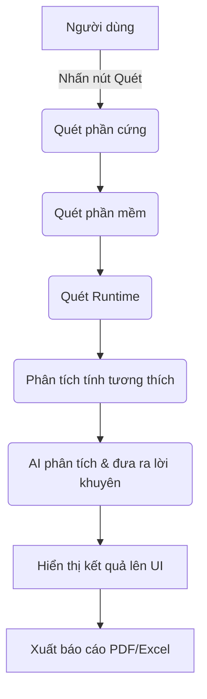
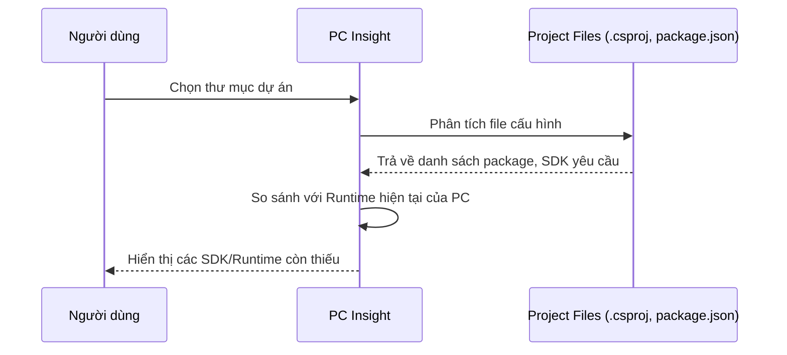

# Luồng hệ thống (System Flows)

Tài liệu này mô tả chi tiết các luồng hoạt động chính của hệ thống PC Insight.

## 1. Luồng hoạt động tổng thể (Main Flow)

## 2. Luồng phân tích dự án (Project Analyzer - V2.0)
Hệ thống đọc các file cấu hình của project để tìm ra các Dependency còn thiếu trên máy tính hiện tại.

## 3. Luồng AI Advisor
1. Đóng gói dữ liệu quét (JSON)
2. Gửi request tới OpenAI API / Gemini API
3. Nhận phản hồi dạng văn bản tự nhiên
4. Parse và hiển thị lên giao diện theo từng danh mục (Lỗi, Cảnh báo, Đề xuất nâng cấp).
