# Sơ đồ thực thể liên kết (ERD)

Tài liệu này mô tả sơ đồ thực thể liên kết (ERD) của cơ sở dữ liệu SQLite trong ứng dụng PC Insight, dựa trên 10 luồng hoạt động cốt lõi.

## 1. Thiết kế tổng thể

Vì đây là một ứng dụng Desktop, cơ sở dữ liệu nội bộ (SQLite) sẽ lưu trữ các lần quét (Scan Session) của người dùng để họ có thể xem lại lịch sử và theo dõi sự thay đổi của máy tính qua thời gian.

Các bảng (Table) chính bao gồm:
- **SCAN_SESSION**: Bảng trung tâm lưu trữ thông tin của mỗi lần quét.
- **HARDWARE_INFO**: Lưu trữ cấu hình phần cứng theo từng lần quét.
- **SOFTWARE_INFO**: Danh sách phần mềm đã cài đặt.
- **RUNTIME_INFO**: Danh sách các Runtime/SDK có sẵn hoặc bị thiếu.
- **COMPATIBILITY_REPORT**: Điểm số tương thích cho từng phần mềm/game.
- **AI_RECOMMENDATION**: Lời khuyên/đề xuất từ AI sinh ra sau khi quét.
- **DRIVER_INFO**: Phiên bản driver và trạng thái cần cập nhật (cho lộ trình bản 2.1).

## 2. Sơ đồ ERD (Mermaid)

```mermaid
erDiagram
    SCAN_SESSION ||--o{ HARDWARE_INFO : "có"
    SCAN_SESSION ||--o{ SOFTWARE_INFO : "có"
    SCAN_SESSION ||--o{ RUNTIME_INFO : "có"
    SCAN_SESSION ||--o{ COMPATIBILITY_REPORT : "có"
    SCAN_SESSION ||--o{ AI_RECOMMENDATION : "có"
    SCAN_SESSION ||--o{ DRIVER_INFO : "có"

    SCAN_SESSION {
        int Id PK "Khóa chính"
        datetime ScanDate "Ngày giờ quét"
        string WindowsVersion "Phiên bản OS"
        float OverallScore "Điểm số tổng thể"
    }

    HARDWARE_INFO {
        int Id PK
        int ScanId FK "Liên kết tới SCAN_SESSION"
        string ComponentType "Loại (CPU, RAM, GPU...)"
        string Name "Tên thiết bị"
        string Specifications "Thông số kỹ thuật"
    }

    SOFTWARE_INFO {
        int Id PK
        int ScanId FK
        string Name "Tên phần mềm (VS, Git...)"
        string Version "Phiên bản"
        string InstallPath "Đường dẫn cài đặt"
    }

    RUNTIME_INFO {
        int Id PK
        int ScanId FK
        string Name "Tên (.NET, Java...)"
        string Version "Phiên bản"
        boolean IsMissing "Trạng thái (Có/Thiếu)"
    }

    COMPATIBILITY_REPORT {
        int Id PK
        int ScanId FK
        string TargetApp "Phần mềm cần test (Unity, VS)"
        float Score "Điểm tương thích (0-100)"
        string Status "Đạt / Cảnh báo / Không đạt"
    }

    AI_RECOMMENDATION {
        int Id PK
        int ScanId FK
        string Category "Phân loại (Nâng cấp, Cài đặt...)"
        string Message "Nội dung lời khuyên"
        string Priority "Độ ưu tiên (Cao/Vừa/Thấp)"
    }
    
    DRIVER_INFO {
        int Id PK
        int ScanId FK
        string DeviceName "Tên thiết bị (VGA, Audio...)"
        string DriverVersion "Phiên bản hiện tại"
        boolean NeedsUpdate "Cần cập nhật không"
    }
```

## 3. Giải thích mối quan hệ (Relationships)

Cơ sở dữ liệu của PC Insight được thiết kế xoay quanh mô hình **One-to-Many (1:N)** lấy `SCAN_SESSION` làm gốc:
- Mỗi lần người dùng nhấn nút "Quét", hệ thống tạo ra một bản ghi `SCAN_SESSION` đại diện cho phiên làm việc đó.
- Các module quét (Hardware, Software, Runtime...) sẽ thu thập dữ liệu và insert vào các bảng tương ứng (`HARDWARE_INFO`, `SOFTWARE_INFO`...) với khóa ngoại `ScanId` trỏ về bản ghi `SCAN_SESSION`.
- Module AI Advisor sau khi nhận kết quả thô sẽ sinh ra các lời khuyên và lưu vào `AI_RECOMMENDATION`, gắn liền với ID của lần quét đó.
- Việc tổ chức DB theo cách này giúp ứng dụng có thể lưu trữ lịch sử, vẽ biểu đồ so sánh hiệu năng theo thời gian thay vì chỉ lưu tạm trên RAM và bị mất khi tắt app.
