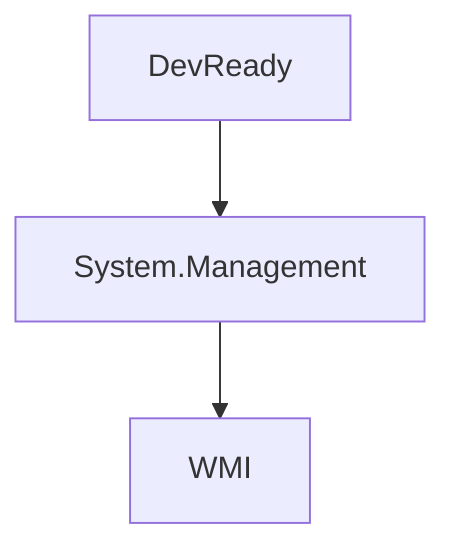
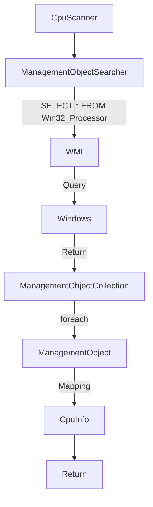

# Tìm hiểu WMI và cách DevReady lấy dữ liệu phần cứng

**Mục tiêu:** Hiểu được cách DevReady lấy thông tin phần cứng từ Windows trước khi bắt đầu viết `CpuScanner`.

## 1. WMI là gì?

**WMI** (Windows Management Instrumentation) là hệ thống quản lý thông tin của Windows. 

Có thể hiểu WMI như một kho dữ liệu của Windows chứa thông tin về:
- CPU
- RAM
- GPU
- Disk
- BIOS
- Mainboard
- Network
- Battery
- USB
- Services
- Processes
- ...

> **Lưu ý:** WMI không phải do DevReady tạo ra, mà đã có sẵn trong Windows.

## 2. System.Management là gì?

`System.Management` là thư viện của C# dùng để giao tiếp với WMI. Nó đóng vai trò là cầu nối giữa chương trình C# và Windows.



Nếu không có thư viện này thì chương trình C# không thể truy vấn WMI.

## 3. ManagementObjectSearcher là gì?

`ManagementObjectSearcher` là class dùng để gửi câu truy vấn đến WMI. 

Nó **không chứa dữ liệu**. Nó chỉ làm nhiệm vụ:
1. Nhận câu truy vấn.
2. Gửi câu truy vấn đến WMI.
3. Nhận kết quả trả về.

Ví dụ:
```csharp
var searcher = new ManagementObjectSearcher("SELECT * FROM Win32_Processor");
```
Đến đây **chưa lấy dữ liệu CPU**. Nó chỉ mới chuẩn bị câu truy vấn.

## 4. `SELECT * FROM Win32_Processor` là gì?

Đây là câu truy vấn WMI. Nó rất giống SQL.

- **Ví dụ SQL:** `SELECT * FROM Student`
- **Trong WMI:** `SELECT * FROM Win32_Processor`

Nghĩa là: Lấy toàn bộ thông tin CPU từ Windows.

### Một số WMI Class phổ biến:

| WMI Class | Chức năng |
| :--- | :--- |
| `Win32_Processor` | CPU |
| `Win32_PhysicalMemory` | RAM |
| `Win32_VideoController` | GPU |
| `Win32_DiskDrive` | Ổ cứng |
| `Win32_OperatingSystem` | Hệ điều hành |

## 5. Khi nào Windows mới thực sự xử lý câu truy vấn?

Sau khi tạo Searcher:
```csharp
var searcher = new ManagementObjectSearcher("SELECT * FROM Win32_Processor");
```
Windows chưa làm gì cả. 

Chỉ khi gọi lệnh:
```csharp
searcher.Get();
```
Thì:
1. Query mới được gửi đến WMI.
2. WMI mới bắt đầu xử lý.
3. Windows mới trả dữ liệu về.

## 6. ManagementObjectCollection là gì?

Sau khi gọi `searcher.Get();`, ta nhận được một `ManagementObjectCollection`. Đây là tập hợp các kết quả mà WMI trả về.

Ví dụ:
- **Máy tính cá nhân** -> Có 1 CPU -> Collection có **1 phần tử**.
- **Máy Server** -> Có 2 CPU -> Collection có **2 phần tử**.

Vì vậy, phải dùng vòng lặp `foreach` để duyệt qua collection này.

## 7. ManagementObject là gì?

Trong Collection, mỗi phần tử là một `ManagementObject`.

Ví dụ: CPU số 1. Trong nó chứa:
- `Name`
- `Manufacturer`
- `NumberOfCores`
- `MaxClockSpeed`
- `ProcessorId`
- ...

Sau đó chương trình sẽ lấy từng giá trị này để gán vào class `CpuInfo`.

## 8. Luồng hoạt động của DevReady



## 9. Tư duy quan trọng

**Tạo Object ≠ Thực thi**

Ví dụ:
```csharp
var searcher = new ManagementObjectSearcher("SELECT * FROM Win32_Processor");
```
Chỉ mới:
- Tạo đối tượng.
- Lưu câu truy vấn.
*(Chưa lấy dữ liệu)*

Chỉ khi gọi:
```csharp
searcher.Get();
```
Thì mới:
- Gửi Query.
- WMI xử lý.
- Trả kết quả.

## 10. So sánh với SQL

| Khái niệm | SQL | WMI |
| :--- | :--- | :--- |
| **Nguồn dữ liệu** | SQL Server | WMI |
| **Thực thi truy vấn** | `SqlCommand` | `ManagementObjectSearcher` |
| **Lệnh chạy** | `ExecuteReader()` | `Get()` |
| **Tập kết quả** | `SqlDataReader` | `ManagementObjectCollection` |
| **Dòng dữ liệu** | `DataRow` | `ManagementObject` |

## 11. Kiến thức rút ra (Tổng kết)

1. **WMI** là nơi Windows cung cấp thông tin phần cứng và hệ thống.
2. **`System.Management`** là thư viện giúp C# giao tiếp với WMI.
3. **`ManagementObjectSearcher`** dùng để gửi câu truy vấn.
4. **`searcher.Get()`** mới là lệnh thực thi truy vấn.
5. Kết quả trả về là **`ManagementObjectCollection`**.
6. Mỗi phần tử trong Collection là một **`ManagementObject`**.
7. Dữ liệu từ `ManagementObject` sẽ được ánh xạ (mapping) sang **`CpuInfo`**.
